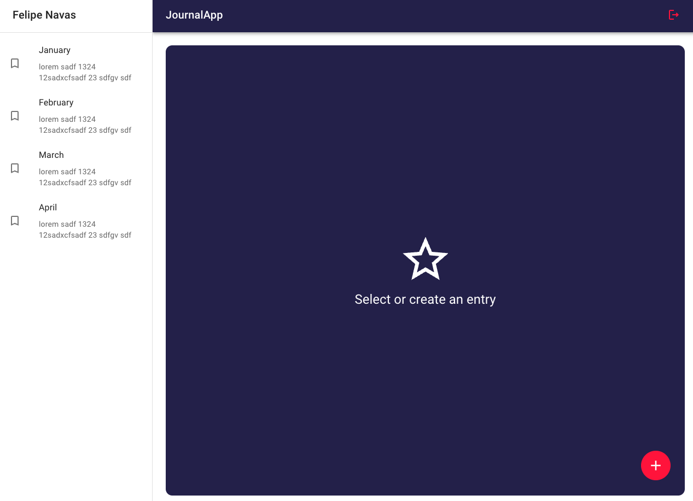

# React Journal App Vite

A React App for Journal with vite

## Description

A React App for Journal with vite

## Demo

You can explore a live version of React Journal App Vite at the following URL:

https://Felipe-Navas.github.io/react-journal-app-vite

## Getting Started

### Dependencies

- `npm`
- `node`

### Installing

- Clone the repository and install dependencies:

```
git clone https://github.com/Felipe-Navas/react-journal-app-vite.git && cd react-journal-app-vite && npm install
```

### Executing program

```
npm start
```

Preview of the main screen:



### Running tests

```
npm test
```

## Authors

- [Felipe Navas](https://www.linkedin.com/in/felipenavaslederhos) - [Email](mailto:felipenavas.itec@gmail.com?subject=[GitHub]%react-journal-app-vite)

## Contributing

1. Fork it (<https://github.com/Felipe-Navas/react-journal-app-vite/fork>)
2. Create your feature branch (`git checkout -b feature/fooBar`)
3. Commit your changes (`git commit -am 'Add some fooBar'`)
4. Push to the branch (`git push origin feature/fooBar`)
5. Create a new Pull Request

## License

This project is licensed under the [MIT License] - see the LICENSE file for details
